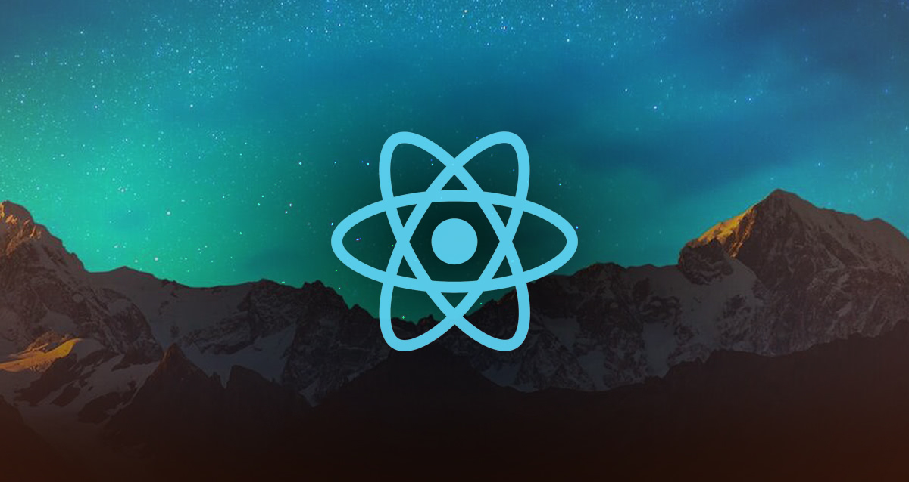

### Hey! Welcome to my profile! How is it going? 👋
 

### About me
I'm a backend, frontend and mobile developer, currently working at personal projects and searching for an opportunity as a trainee 😁.
<ul>
<li> <strong>Learning</strong> 📖 - ReactJS, React Native, NodeJS (with supplementary backend technologies) and Typescript. </li>
<li> <strong>Courses</strong> 🗃 - DevReactJS, GoStack 11.0 and many others.</li>

</ul>
 
 

<!--
**marmittfull/marmittfull** is a ✨ _special_ ✨ repository because its `README.md` (this file) appears on your GitHub profile.

Here are some ideas to get you started:

- 🔭 I’m currently working on ...
- 🌱 I’m currently learning ...
- 👯 I’m looking to collaborate on ...
- 🤔 I’m looking for help with ...
- 💬 Ask me about ...
- 📫 How to reach me: ...
- 😄 Pronouns: ...
- ⚡ Fun fact: ...
-->